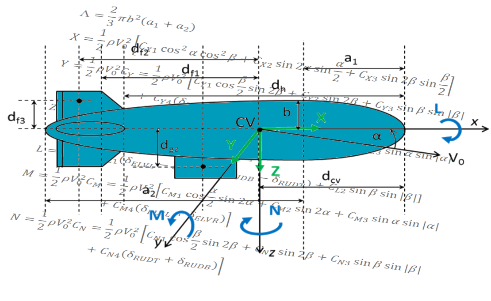

# Modélisation et simulation dynamique

Enseignant référent : Bruno Denis

## Modélisation dynamique

Étudiants (4):

- Loïs Otalora - lois.otalora@ens-paris-saclay.fr
- Noah Tournier - noah.tournier@ens-paris-saclay.fr
- Léo-Paul Dewaele - 	leo-paul.dewaele@ens-paris-saclay.fr
- Bastien Jacques - bastien.jacques@ens-paris-saclay.fr

**objectif** : établir un modèle de la dynamique du ballon (toutes les hypothèses ajoutées devront être étayées). Les nombreux paramètres du modèle devront être valués (par mesure, par identification, ...). En relation avec le thème "système propulsif et directif" il faudra valider que le ballon sera contrôlable, c'est-à-dire qu'il existe une poussée applicable pour assurer le vol.

## Simulateur

Étudiants (4):

- Arthur Poure -	arthur.poure@ens-paris-saclay.fr
- Romain Maison - romain.maison@ens-paris-saclay.fr
- Emilien Dufresne - emilien.dufresne@ens-paris-saclay.fr

Le simulateur retenu est [Webots](https://www.cyberbotics.com/) (Open Source Robot Simulator)

- guide utilisateur https://www.cyberbotics.com/doc/guide/index
- tutoriaux https://www.cyberbotics.com/doc/guide/tutorials

Un exemple de dirigeable est proposé dans la bibliothèque du logiciel https://cyberbotics.com/doc/guide/blimp?version=R2021b

## Bibliographie

[1] M. Z. Ashraf et M. A. Choudhry, « Dynamic modeling of the airship with Matlab using geometrical aerodynamic parameters », Aerospace Science and Technology, vol. 25, nᵒ 1, p. 56‑64, mars 2013, doi: 10.1016/j.ast.2011.08.014 (./bibliographie/Ashraf and Choudhry - 2013 - Dynamic modeling of the airship with Matlab using .pdf)

[2] Chaâbani Saïd, « Dynamique non-linéaire d’un dirigeable flexible », Université d’Evry Val d’Essonne, 2014. Disponible sur: http://www.theses.fr/2014EVRY0008/document

[3] M. Khamlia, « Contribution à la modélisation et la commande des dirigeables gros porteurs non-conventionnels », phdthesis, Université Paris Saclay ; Université d’Evry-Val-d’Essonne ; Ecole Polytechnique de Tunis, 2018. Disponible sur: [https://hal.science/tel-02095871](https://hal.science/tel-02095871)

[4] R. Kukillaya et A. Pashilkar, Simulink model development, validation and analysis of high altitude airship. 2017. doi: 10.13140/RG.2.2.11844.22400 (./bibliographie/Kukillaya and Pashilkar - 2017 - Simulink model development, validation and analysi.pdf)

[5] Y. Li, M. Nahon, et I. Sharf, « Airship dynamics modeling: A literature review », Progress in Aerospace Sciences, vol. 47, nᵒ 3, p. 217‑239, avr. 2011, doi: 10.1016/j.paerosci.2010.10.001 (https://www.sciencedirect.com/science/article/pii/S0376042110000618)
