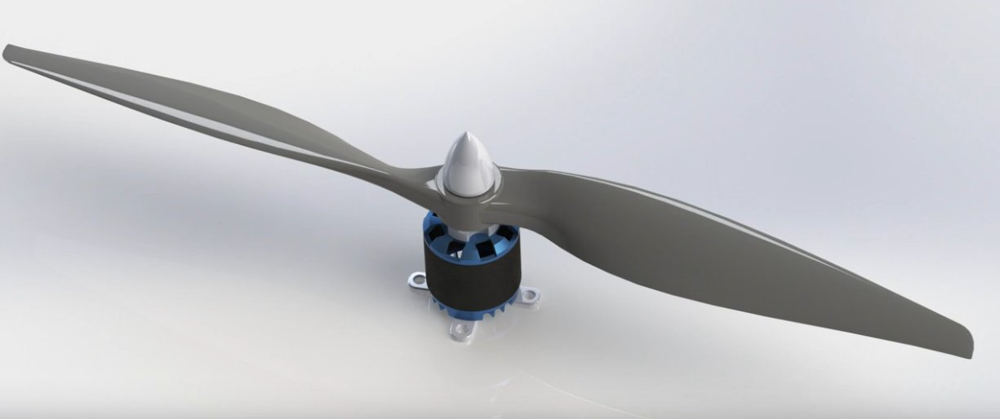

# Propulsion à hélice

Enseignant référent : Bruce Anglade

Étudiants (4) :

- Nicolas Detzen - nicolas.detzen@ens-paris-saclay.fr
- Louis Amitrano - louis.amitrano@ens-paris-saclay.fr
- Ulysse Poulain - ulysse.poulain@ens-paris-saclay.fr
- Ahmed Nachawati- ahmed.nachawati@ens-paris-saclay.fr

**objectif** : étudier la relation entre l'effort de poussée et le signal de commande, la masse totale (hélice, moteur, esc), la consommation électrique.

## Bibliographie

[1] Blimp Drone Thruster Design Overview, (23 juillet 2019). Disponible sur: https://www.youtube.com/watch?v=tUxTVcdhqJs

[2] N. Landell-Mills, Propeller thrust explained by Newtonian physics. 2021. Disponible sur: https://www.researchgate.net/publication/350604844_Propeller_thrust_explained_by_Newtonian_physics

[3] Comment savoir si son moteur et son hélice feront voler l’avion RC, (17 juillet 2022). Disponible sur: https://www.youtube.com/watch?v=99sh-BjobWw

[4] « Aircraft Propeller Theory », AeroToolbox, 24 avril 2020. Disponible sur: https://aerotoolbox.com/propeller/

[5] « Théorie de la quantité de mouvement », Wikipédia. 30 juin 2023. Disponible sur: https://fr.wikipedia.org/w/index.php?title=Th%C3%A9orie_de_la_quantit%C3%A9_de_mouvement&oldid=205599257
