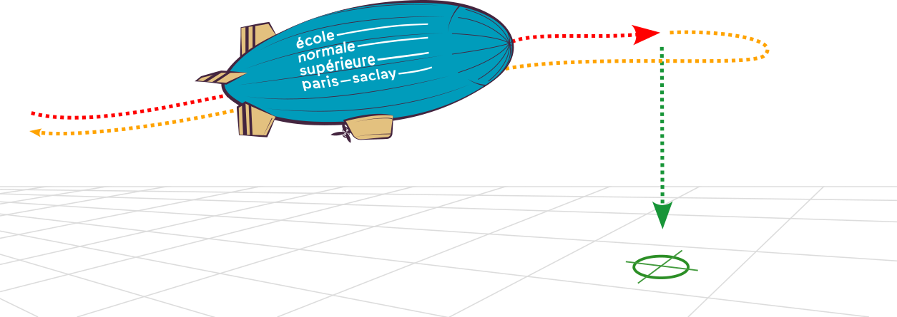

# CoBRA

Le projet CoBRA (Course de Ballons Réactifs et Autonomes) à pour objectif de construire un ballon dirigeable capable de suivre un parcours de façon autonome et de larguer un colis

## 1 Constitution des équipes

- Equipe 1 - 
- Equipe 2 - 
- Equipe 3 - 

Chaque équipe doit fournir au moins 1 membre à chacun des 4 groupes de travail suivants :
* Préhension & Dépot
* Optimisation de la cinématique de vol
* Modélisation & Contrôle/Commande
* Informatique embarquée & Localisation

## 2 Analyse fonctionnelle et état de l'art
La première séance est consacrée à un travail d'étude générale du problème et d'état de l'art (projet 2023_2024 et autres dirigeables blimp).
* Découper le problème en plusieurs fonctions,
* Pour chaque fonction, spécifier les performances attendues,
* Etudier les solutions retenues en 2023 et les solutions retenues pour d'autres dirigeables,
* Etablir un schéma synoptique du dirigeable.

La semaine suivante, les groupes de travail commenceront leurs études.

