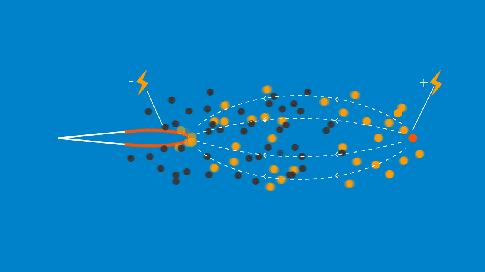

# Propulsion ionique

Enseignant référent : Fabien Adam

Étudiants (4) :

- Chemsdine Ahmidach
- Melchior Personnaz
- Eliot Morard
- Samuel Dahan
- Gatien Séguy

**objectif** : élaborer un prototype et identifié l'effort de poussée obtenue en fonction du des paramètres géométriques, des matériaux et de la tension d'alimentation.

## Bibliographie

[1] S. Bernard et J.-L. Naudin, « Le projet Blimp-Lifter ». Disponible sur: http://lifterproject.online.fr/blimplifter/index.htm

[2] Ion Thruster (Side), (29 juillet 2021). Disponible sur: https://www.youtube.com/watch?v=zYVo_XjFou4

[3] Ionocraft flying, (30 août 2015). Disponible sur: https://www.youtube.com/watch?v=7nM2u2FDWsQ

[4] Electroaerodynamic Propulsion:  Is it viable?, (28 novembre 2022). Disponible sur: https://www.youtube.com/watch?v=YaLEClKGnXc

[5] C. K. Gilmore, « Electro-aerodynamic thrust for fixed-wing aircraft propulsion », Thesis, Massachusetts Institute of Technology, 2017. Disponible sur: 
https://dspace.mit.edu/handle/1721.1/112452

[6] N. Gomez-Vega, H. Xu, J. M. Abel, et S. R. H. Barrett, « Performance of decoupled electroaerodynamic thrusters », Applied Physics Letters, vol. 118, nᵒ 7, p. 074101, févr. 2021, doi: 10.1063/5.0038208

[7] Overview of MIT’s solid-state airplane, (22 novembre 2018). Disponible sur: https://www.youtube.com/watch?v=TeJyMbSSUIc

[8] J.-L. Naudin, « The Lifters Experiments ». Disponible sur: http://jnaudin.free.fr/lifters/main.htm

[9] « MIT engineers fly first-ever plane with no moving parts », MIT News | Massachusetts Institute of Technology, 21 novembre 2018. Disponible sur: https://news.mit.edu/2018/first-ionic-wind-plane-no-moving-parts-1121

[10] « Effet Biefeld-Brown », Wikipédia. 21 avril 2023. Disponible sur: https://fr.wikipedia.org/w/index.php?title=Effet_Biefeld-Brown

Ajouts des étudiants :

[11] « Force on an Asymmetric Capacitor », Thomas B. Bahder.,  Christian Fazi, ARMY RESEARCH LAB ADELPHI MD (2003), Disponible sur https://apps.dtic.mil/sti/pdfs/ADA416740.pdf

[12] Condensateur constitué par deux cylindres conducteurs: http://gerald.philippe.free.fr/files/2011/Conducteurs%20cylindriques%20en%20electrostatique.pdf
                   
[12 bis] https://claude-gimenes.fr/physique/charges-electriques/electrostatique/-iii-conducteurs-caracteristiques-principales
[13] https://arxiv.org/ftp/arxiv/papers/2002/2002.11662.pdf

[14] lien excel des mesures de la manipulation : https://ensparissaclayfr-my.sharepoint.com/:x:/g/personal/eliot_morard_ens-paris-saclay_fr/EfxHjnEue7dDnhFTeHGlXIUB3nb06A8fXRtblNC-Fcx1Bg?e=vHxJ4n

[15] lien excel du planning prévisionnel : https://1drv.ms/x/s!AoqnbC4eiIVSijU25wS_YBNnT-w0
