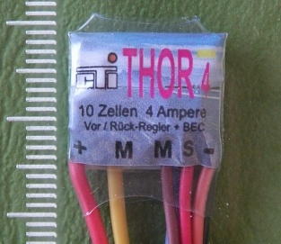
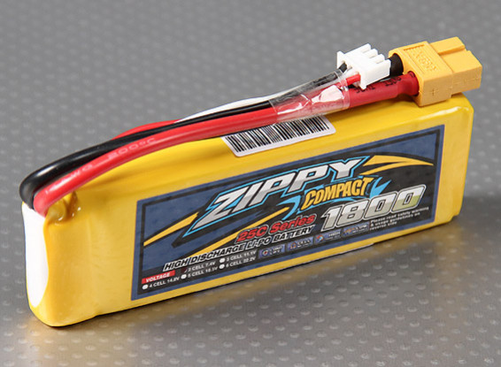
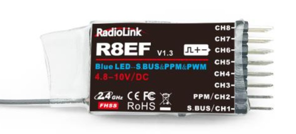
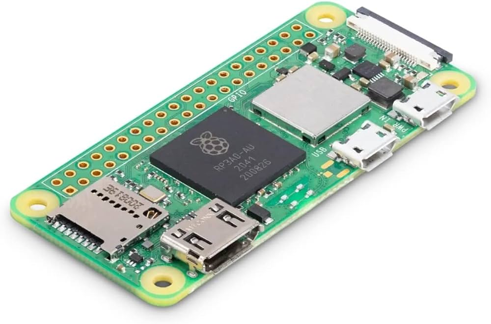
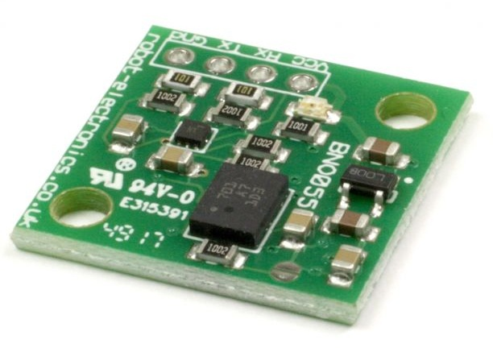
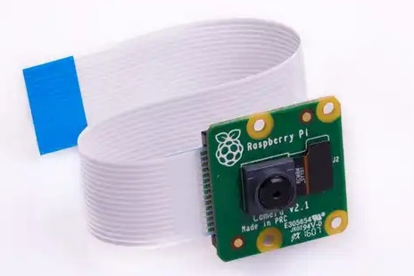
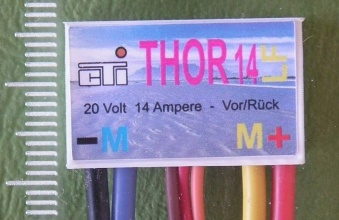
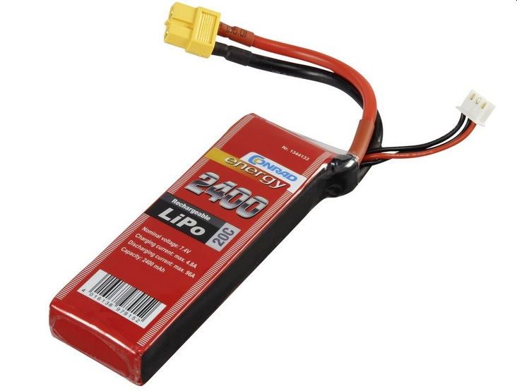

# Composants

## Composants de la solution constructeur, le [Ballon de 2m de chez Aero Drum Ltd](https://www.rc-zeppelin.com/fr/int%C3%A9rieur-rc-blimps-2m.html)

|     |     |
| --- | --- |
|  | Moteur hélice KAVAN Brushless motor [C2822-1200](https://www.kavanrc.com/en/item/kavan-brushless-motor-c2822-1200-140792) Kv = 1200 rpm/V Alim Lixx 2-3S Diamètre axe 3.175 mm  Poids: 34 g|
|  | Régulateur pour moteur brushless Hobbywing Skywalker 20A [Manuel](./hobbywing-skywalker-20a-regulateur-brushless-mode-demploi.pdf) BEC 5V/2A Alim LiPo 2-3S Dimension 48x22,5 x 6 mm Poids: 16,5 g|
|  | Régulateur pour MCC deux sens de marche CTI [Thor 4](https://www.cti-modellbau.de/-74-102-110-161.html)  Taille: 16 x 13 x 4 mmm |
| | Batterie [Zippy compact 1800mAh 2S 25C Lipo](https://hobbyking.com/fr_fr/zippy-compact-1800mah-2s-25c-lipo-pack.html) Voltage: 2S1P / 2 cellules / 7.4V Poids: 110g Dimensions: 105x34x16mm Solde Fiche: JST-XH Fiche de décharge: XT60 |
|  | Récepteur radio [Radiolink R8EF, 2.4G 8 channels receive](https://www.radiolink.com/r8ef) [manuel](./Radiolink_R8EF+Introduction+Manul_2021.8.3.pdf) Poids: 7g Taille: 41.5 x 21.5 x 11.5mm |
|  | Emetteur radio [Radiolink T8EF(TB), 2.4G 8 channels receive](https://www.radiolink.com/r8ef) [manuel](./Radiolink_T8FB(BT)+User+Manual(with+R8EF+receiver)+2023.9.14.pdf), [Logiciels](https://www.radiolink.com/t8fb_bt_app)

## Composants pour défi 2024

|     |     |
| --- | --- |
| |Contrôler - Raspberry Pi Zero 2 W [schéma électrique](https://datasheets.raspberrypi.com/rpizero2/raspberry-pi-zero-2-w-reduced-schematics.pdf?_gl=1*u0n2y4*_ga*MTk0MzIzNzE2MC4xNzA3NTU4NDgy*_ga_22FD70LWDS*MTcwNzU1ODQ4Mi4xLjEuMTcwNzU1OTA1MS4wLjAuMA..) [plan mécanique](https://datasheets.raspberrypi.com/rpizero2/raspberry-pi-zero-2-w-mechanical-drawing.pdf?_gl=1*28rb06*_ga*MTk0MzIzNzE2MC4xNzA3NTU4NDgy*_ga_22FD70LWDS*MTcwNzU1ODQ4Mi4xLjEuMTcwNzU1OTA1MS4wLjAuMA..) [Documentation](https://www.raspberrypi.com/documentation/)|
|  | Module orientation absolue 9 DOF [Robot electronics BNO 055](https://www.robot-electronics.co.uk/products/sensors/compass-sensors/bno055.html) [Datasheet](./BNO055_datasheet.pdf), [Schéma](./BNO055_datasheet.pdf), [Layout](./BNO055_layout.pdf) BME680|
||Capteur environnemental [SparkFun Environmental Sensor Breakout - BME680](https://www.sparkfun.com/products/16466) |
| | Module servo 16 canaux  M5Stack [ SERVO2 Module 16 Channels - 13.2 (PCA9685)](https://shop.m5stack.com/products/servo2-module-16-channels-13-2-pca9685) |
||Raspberry Pi [Camera Module 2](https://www.raspberrypi.com/products/camera-module-v2/)|
|  | Moteur brushless pour hélice [Pichler Pulsar Shocky Pro 2204](https://shop.pichler.de/Brushless-Motor-PULSAR-Shocky-Pro-2204-1400-KV_1) |
|  | Régulateur brushless pour moteur hélice  [Pichler XQ+ 20 Slim](https://shop.pichler.de/Brushless-Speed-Controller-ESC-XQ-20-Slim) [manuel](./pichler-xq-20-slim_manuel.pdf) |
| | Régulateur pour MCC deux sens de marche CTI [Thor 14](https://www.cti-modellbau.de/-150-151-152-166.html) |
| | Batterie [Conrad 2400mAh 2S 20C Lipo](https://www.conrad.fr/fr/p/pack-de-batterie-lipo-7-4-v-2400-mah-conrad-energy-1344133-20-c-softcase-xt60-1344133.html) Voltage: 2S1P / 2 cellules / 7.4V Poids: 143g Dimensions: 112x35x19mm Connecteur: XH Raccordement: XT60 |
