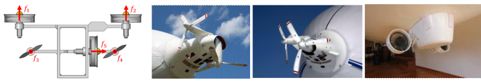

# Système propulsif et directif

Enseignant référent : Bastien Durand

**Objectif** : proposer et comparer plusieurs systèmes pour déplacer et diriger le ballon (critère de comparaison, masse embarquée, consommation d'énergie, contrôlabilité, ...)

## Bibliographie

[1] J. R. H. Carvalho et al., « System Architecture of a Robotics Airship », in Proceedings of IDEAS 2019, L. Pereira, J. R. H. Carvalho, P. Krus, M. Klofsten, et V. J. De Negri, Éd., in Smart Innovation, Systems and Technologies. Cham: Springer International Publishing, 2021, p. 13‑22. doi: 10.1007/978-3-030-55374-6_2 [(paper)](./bibliographie/Carvalho et al. - 2021 - System Architecture of a Robotics Airship.pdf)

[2] F. Repoulias et E. Papadopoulos, « Dynamically feasible trajectory and open-loop control design for unmanned airships », in 2007 Mediterranean Conference on Control & Automation, juin 2007, p. 1‑6. doi: 10.1109/MED.2007.4433820. Disponible sur: https://ieeexplore.ieee.org/document/4433820

[3] S. Ul Ferdous, A. Mohammadi, et S. Lakshmanan, « Developing a low-cost autonomous blimp with a reduced number of actuators », in Unmanned Systems Technology XXI, C. M. Shoemaker, P. L. Muench, et H. G. Nguyen, Éd., Baltimore, United States: SPIE, mai 2019, p. 13. doi: 10.1117/12.2519252. Disponible sur: https://www.spiedigitallibrary.org/conference-proceedings-of-spie/11021/2519252/Developing-a-low-cost-autonomous-blimp-with-a-reduced-number/10.1117/12.2519252.full

[4] Y. Wen, L. Chen, Y. Wang, D. Sun, D. Duan, et J. Liu, « Nonlinear DOB-based explicit NMPC for station-keeping of a multi-vectored propeller airship with thrust saturation », The Aeronautical Journal, vol. 122, nᵒ 1257, p. 1753‑1774, nov. 2018, doi: 10.1017/aer.2018.91 (https://www.cambridge.org/core/journals/aeronautical-journal/article/abs/nonlinear-dobbased-explicit-nmpc-for-stationkeeping-of-a-multivectored-propeller-airship-with-thrust-saturation/2D727C911338AEB2495CE49D440490F7)
